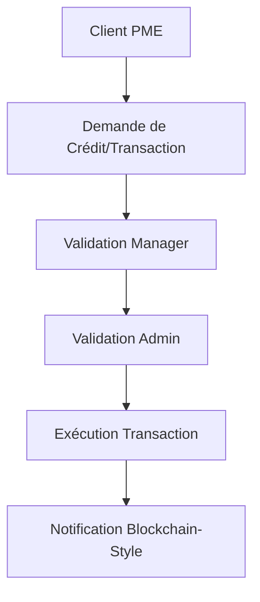

# Documentation du Workflow de Validation des Contrats et Transactions Financières

## Table des Matières
1. [Aperçu du Système](#aperçu-du-système)
2. [Rôles et Permissions](#rôles-et-permissions)
3. [Matrice de Responsabilité](#matrice-de-responsabilité)
4. [Workflow de Validation des Transactions](#workflow-de-validation-des-transactions)
5. [Modèle de Validation Blockchain à Trois Parties](#modèle-de-validation-blockchain-à-trois-parties)
6. [Processus de Validation par Type de Transaction](#processus-de-validation-par-type-de-transaction)
7. [Sécurité et Audit](#sécurité-et-audit)

## Aperçu du Système

Le microservice portfolio-institution implémente un système de validation hiérarchique pour les transactions financières, basé sur une matrice de responsabilité et des principes de validation blockchain à trois parties : **Institution Financière**, **Gestionnaire**, et **Client Bénéficiaire (PME)**.

### Architecture de Validation



## Rôles et Permissions

### 1. ADMIN (Administrateur Institution)
**Niveau d'accès** : Maximum
**Responsabilités principales** :
- Validation finale des transactions importantes (> seuil défini)
- Configuration des paramètres système
- Gestion des utilisateurs et des permissions
- Supervision globale des portefeuilles

**Permissions spécifiques** :
```typescript
permissions: [
  'admin:full-access',
  'contracts:approve',
  'disbursements:approve',
  'settings:manage',
  'users:manage',
  'portfolios:manage'
]
```

### 2. MANAGER (Gestionnaire de Portefeuille)
**Niveau d'accès** : Élevé
**Responsabilités principales** :
- Validation des demandes de crédit
- Approbation des déboursements
- Gestion des remboursements
- Supervision des analystes

**Permissions spécifiques** :
```typescript
permissions: [
  'credit-requests:approve',
  'disbursements:approve',
  'repayments:process',
  'contracts:manage',
  'reports:view'
]
```

### 3. ANALYST (Analyste de Crédit)
**Niveau d'accès** : Moyen
**Responsabilités principales** :
- Analyse des demandes de crédit
- Préparation des rapports de risque
- Validation préliminaire des dossiers

**Permissions spécifiques** :
```typescript
permissions: [
  'credit-requests:analyze',
  'reports:generate',
  'contracts:view',
  'risk-assessment:perform'
]
```

### 4. VIEWER (Utilisateur en Lecture)
**Niveau d'accès** : Consultation uniquement
**Responsabilités principales** :
- Consultation des tableaux de bord
- Accès aux rapports assignés

**Permissions spécifiques** :
```typescript
permissions: [
  'dashboard:view',
  'reports:view-assigned',
  'contracts:view-assigned'
]
```

### 5. CLIENT PME (Client Bénéficiaire)
**Niveau d'accès** : Limité à ses propres dossiers
**Responsabilités principales** :
- Soumission des demandes de financement
- Validation des conditions contractuelles
- Confirmation de réception des fonds

## Matrice de Responsabilité

### RACI Matrix pour les Transactions Financières

| Action | Client PME | Analyst | Manager | Admin | Description |
|--------|------------|---------|---------|-------|-------------|
| **Demande de Crédit** | R | I | A | C | Client responsable, Manager approuve |
| **Analyse de Risque** | I | R | A | I | Analyst responsable, Manager approuve |
| **Approbation Crédit** | I | I | R | A | Manager responsable, Admin approuve si montant élevé |
| **Déboursement** | C | I | R | A | Manager responsable, Client confirme réception |
| **Remboursement** | R | I | A | C | Client responsable, suivi par équipe |
| **Modification Contrat** | A | I | R | A | Nécessite accord Client et validation Manager/Admin |

**Légende** :
- **R** (Responsible) : Responsable de l'exécution
- **A** (Accountable) : Responsable de la validation finale
- **C** (Consulted) : Consulté avant décision
- **I** (Informed) : Informé du résultat

## Workflow de Validation des Transactions

### 1. Workflow des Demandes de Crédit

```typescript
enum CreditRequestStatus {
  DRAFT = 'draft',
  PENDING = 'pending',
  ANALYSIS = 'analysis',
  APPROVED = 'approved',
  REJECTED = 'rejected',
  DISBURSED = 'disbursed'
}
```

**Étapes de validation** :

1. **Soumission** (Client PME)
   - Statut : `DRAFT` → `PENDING`
   - Permissions requises : Client authentifié
   - Validation : Dossier complet

2. **Analyse** (Analyst)
   - Statut : `PENDING` → `ANALYSIS`
   - Permissions requises : `@Roles('admin', 'credit_manager')`
   - Actions : Évaluation de risque, scoring

3. **Approbation Manager** (Manager)
   - Statut : `ANALYSIS` → `APPROVED`
   - Permissions requises : `@Roles('admin', 'credit_manager')`
   - Seuils : Montants selon limites définies

4. **Validation Admin** (Admin - si nécessaire)
   - Statut : Validation finale pour montants élevés
   - Permissions requises : `@Roles('admin')`
   - Critères : Montant > seuil_admin ou profil de risque élevé

### 2. Workflow des Déboursements

```typescript
enum DisbursementStatus {
  DRAFT = 'draft',
  PENDING = 'pending',
  APPROVED = 'approved',
  REJECTED = 'rejected',
  PROCESSING = 'processing',
  COMPLETED = 'completed',
  FAILED = 'failed',
  CANCELED = 'canceled'
}
```

**Processus de validation** :

1. **Création** (System/Manager)
   ```typescript
   @Roles('admin', 'finance-manager')
   async approve(@Param('id') id: string, @Body() approveDto: any)
   ```

2. **Approbation** (Finance Manager)
   - Vérification des prérequis
   - Validation des informations bancaires
   - Signature électronique

3. **Exécution** (Admin/Finance Manager)
   ```typescript
   @Roles('admin', 'finance-manager')
   async process(@Param('id') id: string, @Body() executeDto: any)
   ```

### 3. Workflow des Remboursements

```typescript
enum RepaymentStatus {
  PENDING = 'pending',
  PROCESSING = 'processing',
  COMPLETED = 'completed',
  FAILED = 'failed',
  PARTIAL = 'partial'
}
```

## Modèle de Validation Blockchain à Trois Parties

### Concept de Consensus

Le système implémente un modèle inspiré de la blockchain avec validation multi-parties :

1. **Partie 1 : Institution Financière** (Admin/Manager)
   - Validation des conditions contractuelles
   - Vérification de la conformité réglementaire
   - Signature institutionnelle

2. **Partie 2 : Gestionnaire de Portefeuille** (Manager)
   - Validation opérationnelle
   - Vérification des risques
   - Signature de gestion

3. **Partie 3 : Client Bénéficiaire** (PME)
   - Confirmation des conditions
   - Acceptation des termes
   - Signature client

### Mécanisme de Signature Électronique

```typescript
// Service de Webhook avec signature sécurisée
private signPayload(payload: any, secret: string): string {
  const hmac = crypto.createHmac('sha256', secret);
  const signature = hmac.update(JSON.stringify(payload)).digest('hex');
  return signature;
}
```

### Validation par Consensus

Pour qu'une transaction soit exécutée, elle doit obtenir :
- ✅ **Signature Institution** (Admin/Manager selon montant)
- ✅ **Signature Gestionnaire** (Manager obligatoire)
- ✅ **Confirmation Client** (PME - selon type de transaction)

## Processus de Validation par Type de Transaction

### 1. Ordres de Paiement (Déboursements)

**Seuils de Validation** :
- < 1M XOF : Manager seul
- 1M-10M XOF : Manager + Admin
- > 10M XOF : Manager + Admin + Validation supplémentaire

**Workflow** :
```typescript
// 1. Soumission
disbursement.status = DisbursementStatus.DRAFT;

// 2. Validation Manager
@Roles('admin', 'finance-manager')
async approve() {
  disbursement.status = DisbursementStatus.APPROVED;
  disbursement.approved_by = userId;
  disbursement.approval_date = new Date();
}

// 3. Exécution sécurisée
@Roles('admin', 'finance-manager')
async execute() {
  disbursement.status = DisbursementStatus.COMPLETED;
  disbursement.executed_by = userId;
  disbursement.execution_date = new Date();
}
```

### 2. Remboursements

**Validation automatique** pour :
- Remboursements programmés
- Virements entrants identifiés

**Validation manuelle** pour :
- Remboursements anticipés
- Remboursements partiels
- Litiges

### 3. Modifications de Contrat

**Validation triple obligatoire** :
1. **Gestionnaire** : Validation opérationnelle
2. **Admin** : Validation réglementaire
3. **Client PME** : Acceptation des nouvelles conditions

## Sécurité et Audit

### Traçabilité des Actions

Chaque action est tracée avec :
```typescript
@Column({ nullable: true })
created_by?: string;

@Column({ nullable: true })
approved_by?: string;

@Column({ nullable: true })
executed_by?: string;

@CreateDateColumn()
created_at!: Date;

@UpdateDateColumn()
updated_at!: Date;
```

### Logs d'Audit

```typescript
// Exemple d'audit trail
{
  action: 'disbursement_approved',
  userId: 'manager_id',
  entityId: 'disbursement_id',
  timestamp: '2025-08-23T10:30:00.000Z',
  metadata: {
    amount: 5000000,
    currency: 'XOF',
    approvalLevel: 'manager'
  }
}
```

### Notifications Blockchain-Style

Le système envoie des notifications à toutes les parties concernées lors de chaque étape de validation, similaire au consensus blockchain :

```typescript
// Notification multi-parties
async notifyStakeholders(transaction: Transaction) {
  await this.webhookService.notify({
    parties: ['institution', 'manager', 'client'],
    transaction: transaction,
    status: 'validation_required',
    signature: this.signPayload(transaction, secret)
  });
}
```

## Exemples d'Implémentation

### Validation d'un Déboursement Important

```typescript
class DisbursementValidationFlow {
  async validateHighValueDisbursement(amount: number, disbursementId: string) {
    const threshold = 10000000; // 10M XOF
    
    if (amount > threshold) {
      // Nécessite validation Admin + Manager + Client
      const validations = await this.getRequiredValidations(amount);
      
      for (const validation of validations) {
        await this.requestValidation(validation.role, disbursementId);
      }
      
      // Attendre consensus des 3 parties
      const consensus = await this.waitForConsensus(disbursementId);
      
      if (consensus.isValid) {
        await this.executeDisbursement(disbursementId);
      }
    }
  }
}
```

Cette documentation reflète l'implémentation actuelle du système basée sur l'analyse du code source, avec des principes de validation multi-niveaux et de consensus inspirés de la blockchain pour assurer la sécurité et la transparence des transactions financières.
